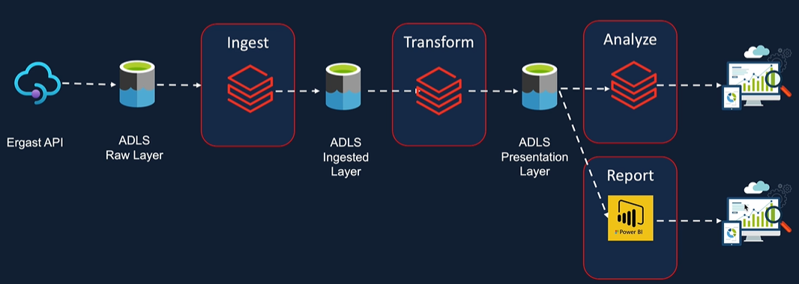

# Formula 1 Data Sport Cloud Data Platform

In this project we will build a Data Lake in azure by ingesting formula one race data from an external API
We will transform for reporting and analysis
we will generate a report using Power BI

# Requirements

## Azure Databricks

## Spark python

## Spark SQL

## Delta Lake

## Azure Data Lake Gen 2

## Azure Data Factory

## Azure key Vault

## PowerBI
