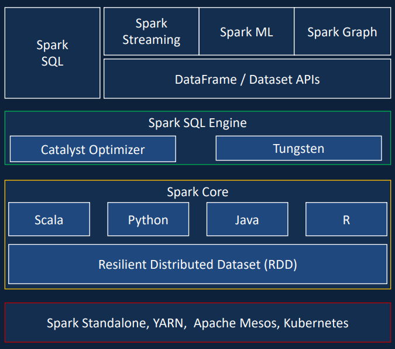
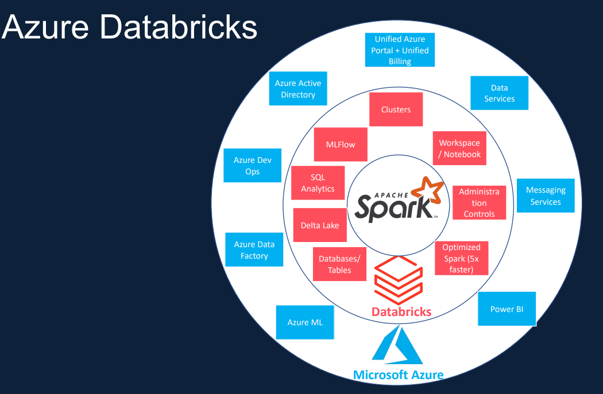

# Formula 1 Data Sport Cloud Data Platform

In this project we will build a Data Lake in azure by ingesting formula one race data from an external API
We will transform for reporting and analysis
we will generate a report using Power BI

# Requirements

## Azure Databricks

## Spark python

## Spark SQL

## Delta Lake

## Azure Data Lake Gen 2

## Azure Data Factory

## Azure key Vault

## PowerBI

Apache Spark
Distributed computing Platform
In-memory processing engine
Unified engine which supports SQL, streaming, ML and
graph processing
Apache Spark is a lightning-fast unified analytics engine for big
data processing and machine learning

After deploying the Azure Data bricks resource group. Add it to a new dashboard to keep all the needed services for this project at one place.

#### Created Cluster formulaone Cluster
